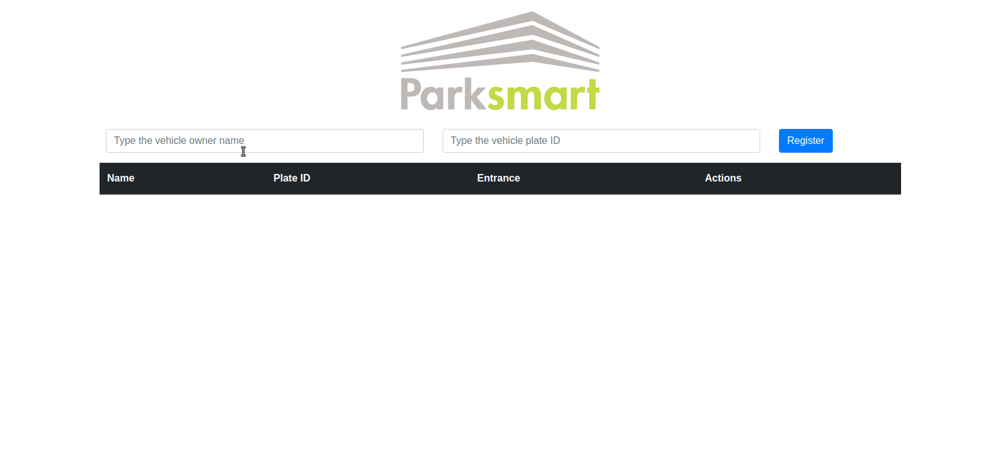

# About the project / _Sobre o projeto_

This project is a simple Parking Lot Control System using Typescript.

_Esse projeto é um sistema simples de Controle de Estacionamento utilizando Typescript._

---

# Skills / _Habilidades_

- HTML, CSS, Javascript
- Typescript
- Bootstrap
- Local Storage

---

# Layout

---

# Deployment / _Implantação_

See it in action/ **Veja em ação**: [https://kelsonbatista.github.io/dio-typescript-parking-lot/](https://kelsonbatista.github.io/dio-typescript-parking-lot
/)
